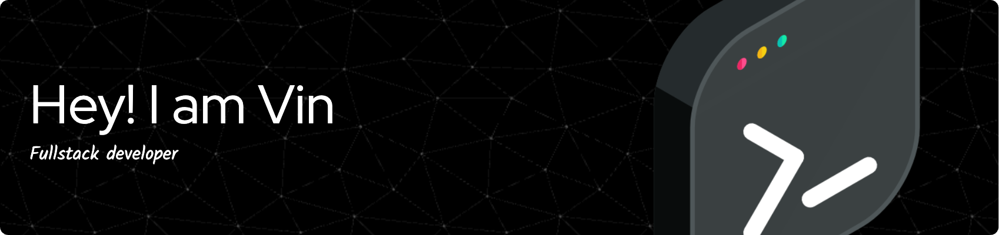

## Hi there 👋

<!--
**Alvino619/Alvino619** is a ✨ _special_ ✨ repository because its `README.md` (this file) appears on your GitHub profile.

Here are some ideas to get you started:

- 🔭 I’m currently working on ...
- 🌱 I’m currently learning ...
- 👯 I’m looking to collaborate on ...
- 🤔 I’m looking for help with ...
- 💬 Ask me about ...
- 📫 How to reach me: ...
- 😄 Pronouns: ...
- ⚡ Fun fact: ...
-->

### 💫 About Me:
I'm currently working on Building responsive and interactive web interfaces using modern technologies like React and Tailwind CSS, with a focus on performance and user experience.  I'm looking to collaborate on Innovative frontend projects that challenge my skills and allow me to contribute to meaningful digital solutions.  I'm looking for help with Exploring advanced frontend techniques, optimizing web performance, and staying updated with the latest industry trends.  I'm currently learning Advanced JavaScript frameworks and tools to enhance my development workflow and deliver higher-quality products.  Ask me about Frontend development best practices, Agile methodologies, or how to create seamless user experiences!  Fun fact I graduated with a degree in Computer Engineering from IPB University and have 3 years of experience turning ideas into functional, beautiful web applications.

# 💻 Tech Stack:
       
# 📊 GitHub Stats:
 
 

---

<h2 align="left">Hi 👋! Play game</h2>

###

 

###